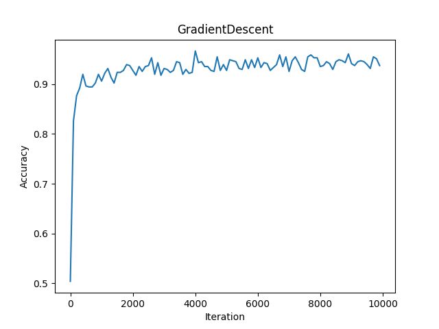

# Russian Tweet Classifier
This is a twofold project. The main idea is to create a chrome extension which highlights tweets that are likely coming from the [Russian political propaganda machine](https://www.cnn.com/2018/10/19/politics/russian-troll-instructions/index.html). The secondary project was to develop an in-house machine learning algorithm to classify and differentiate Russian tweets from these troll farms.  
  
The bulk of our data comes from [the website fivethirtyeight](https://github.com/fivethirtyeight/russian-troll-tweets), which released a dataset of over 1.4 million tweets known to have come from botnets or Russian trolls. For normal, non-malicious tweet data, we used [kaggle's sentiment analysis dataset](https://www.kaggle.com/c/twitter-sentiment-analysis2).  
  
Our model is a ten-layer fully connected neural network built with the abstracted ```tf.layers``` api, with layer widths ```[1024, 1024, 512, 256, 256, 128, 64, 32]``` (motivated by [1], which proved that homogeneity maybe means something).
  
## Preprocessing
We extract only the tweets and classes of each tweet in _process.py_. We have conveniently provided the reader a labeled dataset with _over_ 250k tweets from Russian and non-Russian sources, stored as ```tweets.csv```.  

We make heavy use of sklearn's CountVectorizer object, which allows us to transform a tweet into a fixed ```[5000, 1]``` length vector, based on unigrams and bigrams of each tweet. We keep only the 5000 most occuring instances of words for classification, due to memory constraints on our training hardware.  
  
## Training and Results  
Our best holdout validation accuracy is ```~0.91```, compared to Google's AutoML score of ```0.94```.  
  
We optimize mean squared error using ```tf.GradientDescentOptimizer```, having obtained better results with simple gradient descent than with ```tf.softmax_cross_entropy_with_logits_v2```, ```tf.AdamOptimizer```, or ```tf.AdagradOptimizer```. A sample 10,000 iteration training run is shown below:  
  
  
  
 
  

## References
[1] Rudolph, S. (1997). On topology, size and generalization of non-linear feed-forward neural networks. Neurocomputing, 16(1), pp.1-22. 
