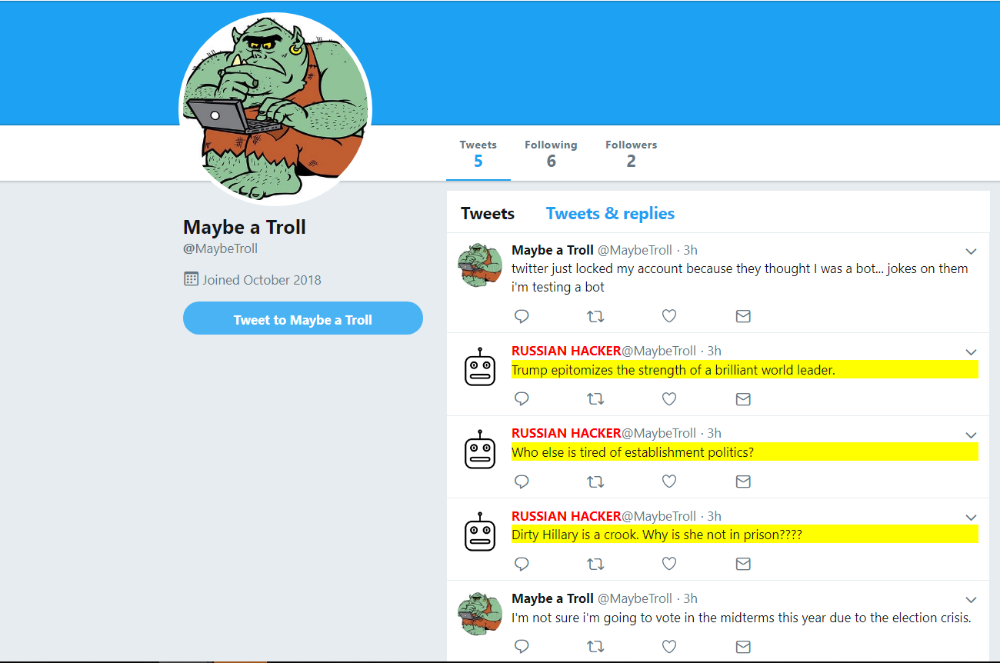

# RuTroll
We will briefly describe the three contributions of our project:
1. A fully functional, twitter augmenting chrome extension that protects the user against foreign propaganda
2. A home-brewed machine learning model comparable to state of the art results on classification of Russian-troll tweets
3. A curated and labeled open source dataset of over 250,000 Russian and non-Russian troll tweets for machine learning tasks

## Introduction  
On 10/17/18, Twitter released a dataset of over 10 million tweets thought to belong to foreign propaganda machines. Along this vein, we thought it apt to focus on a very current and real issue: protecting our democracy. 

## Chrome Extension
We built a chrome extension which modifies the user's twitter experience by highlighting tweets that are suspected to be Russian troll tweets. This was all written in javascript and utilized Google's AutoML, which we trained on data we collected. The extension highlight's tweets that the model we learned thought as "highly russian" (above 90% confidence), and furthermore censors their potentially offensive profile picture.
  
  

## Data and Model
The bulk of our data comes from [the website fivethirtyeight](https://github.com/fivethirtyeight/russian-troll-tweets), which released a dataset of over 1.4 million tweets known to have come from botnets or Russian trolls. For normal, non-malicious tweet data, we used [kaggle's sentiment analysis dataset](https://www.kaggle.com/c/twitter-sentiment-analysis2). We combine the data into a single training file, described later.
  
We wanted to see if we would be able to beat Google's AutoML framework (why not?), so we built our own neural network that classifies the tweets--to surprisingly good results.

Our model is a ten-layer fully connected neural network built with the abstracted ```tf.layers``` api, with layer widths ```[1024, 1024, 512, 256, 256, 128, 64, 32]``` (motivated by [1], which argues that layer-wise homogeneity can help with learning). We were unable to beat the model's accuracy with further model engineering.
  
## Preprocessing
We extract only the tweets and classes of each tweet in _process.py_. We have conveniently provided the reader a labeled dataset with _over_ 250k tweets from Russian and non-Russian sources, stored as ```tweets.csv```. These tweets have had punctuation and some stop words removed, and are machine learning--ready.

We make heavy use of sklearn's ```CountVectorizer``` object, which allows us to transform a tweet into a fixed ```[5000, 1]``` length vector, based on unigrams and bigrams of each tweet. We keep only the 5000 most occuring instances of words for classification, due to memory constraints on our training hardware.  
  
## Training and Overview of Results  
Our best holdout validation accuracy is ```0.91```, compared to Google's AutoML score of ```0.94``` precision (AutoML does not report holdout validation accuracy). This is a great result, and proves that even without extensive preprocessing, feature selection, model engineering, and hyperparameter tuning (we only had a gtx1060 and 24 hours), we are able to get close to state of the art grid search algorithms. Our surprising accuracy implies the data we collected must hold very meaningful intrinsic differences between our chosen classes.
  
We optimize mean squared error using ```tf.GradientDescentOptimizer```, having obtained better results with simple gradient descent than with ```tf.softmax_cross_entropy_with_logits_v2```, ```tf.AdamOptimizer```, or ```tf.AdagradOptimizer```. Results for different optimizers are presented below:

|          	| Validation Acc (5 Run Average) 	|
|----------	|--------------------------------	|
| GradDesc 	| 0.905118087                    	|
| AdaGrad  	| 0.904162557                    	|
| Adam     	| 0.866541337                    	|
   

### Training Curve  


  
## Difficulties
Each task had it's own difficulty. Since we were a team of three, each of us focused on a different part of the problem (and were equally stumped). Spending 5 hours stuck on a single API call in javascript is not something we want to experience again, but we are extremely grateful we stuck it through to have a working product. Furthermore, training our own NLP model was very rewarding, as it is the first time any of us has worked with text and Tensorflow. 

## References
[1] Rudolph, S. (1997). On topology, size and generalization of non-linear feed-forward neural networks. Neurocomputing, 16(1), pp.1-22. 
  

_Submitted to [HackHarvard 2018](https://devpost.com/software/rutroll)
